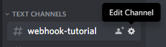

# notifier

[![Latest Version on Packagist][ico-version]][link-packagist]
[](link-styleci)
[![Total Downloads][ico-downloads]][link-downloads]

Send Discord public messages through webhook directly to the Discord server channels. This works by sending a post request with some JSON data to a unique URL Discord provides when you create your Webhook. Take a look at [contributing.md](contributing.md) to see a to do list.

## Installation

You can install the package via composer:

``` bash
$ composer require mehrancodes/laravel-discord-notifier
```

Next you need to publish the package config to add your Discord Webhook URLs.
```bash
$ php artisan vendor:publish --tag=discord-notifier-config
```

### Setting up your Discord Webhook
Discord provides a feature to create Webhooks, but note that it is only available in server channels, not in direct messages. To create a Webhook, click the cog next to the channel in which you wish to set up your Webhook:



Then head to the Webhooks tab, and hit Create Webhook. You'll then be able to specify the name, which is the name that is used when sending messages if none is specifided in the JSON post request.
You can also adjust the channel, and add a default image. Again, that image can later be customized from the JSON post request.

Then at the bottom, you'll get the unique Webhook URL. Paste it in your discord-notifier.php config file.
```php
// config/discord-notifier.php
'channels' => [
    'capitan_hook' => [
        'webhook' => 'https://discord.com/api/webhooks/YOUR_CHANNEL_UNIQUE_IDENTIFIER',
    ],
    // You can add as many Discord channels as you like to this array...
]
```

## Usage
In your logic where you want to send a message to a server channel, you may use the Discord facade
to define the channel name you want to receive the notification message, the content message, and send it.
```php
use MehranCodes\Notifier\Facades\Discord;

Discord::body("The Mehran's new online meeting has ended up successfully")
    ->embeds(['title' => 'View Meeting Details On Nova Panel', 'url' => url('nova/resources/meetings/1')])
    ->send();
```
You can use the [embeds](https://discord.com/developers/docs/resources/channel#embed-object) method
to pass an array of embeded rich content.

## Change log

Please see the [changelog](changelog.md) for more information on what has changed recently.

## Testing

``` bash
$ composer test
```

## Contributing

Please see [contributing.md](contributing.md) for details and a todolist.

## Security

If you discover any security related issues, please email author email instead of using the issue tracker.

## Credits

- [Mehran Rasuli][https://github.com/mehrancodes]

## License

license. Please see the [license file](license.md) for more information.

[ico-version]: https://img.shields.io/packagist/v/jackwestin/notifier.svg?style=flat-square
[ico-downloads]: https://img.shields.io/packagist/dt/jackwestin/notifier.svg?style=flat-square
[ico-travis]: https://img.shields.io/travis/jackwestin/notifier/master.svg?style=flat-square
[ico-styleci]: https://styleci.io/repos/12345678/shield

[link-packagist]: https://packagist.org/packages/jackwestin/notifier
[link-downloads]: https://packagist.org/packages/jackwestin/notifier
[link-travis]: https://travis-ci.org/jackwestin/notifier
[link-styleci]: https://styleci.io/repos/12345678
[link-author]: https://github.com/jackwestin
[link-contributors]: ../../contributors
